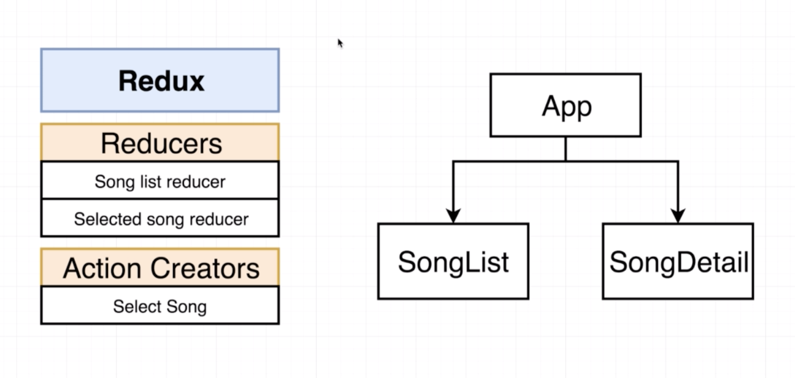

## REDUX CYCLE ##
#1. **Action Creator** : anytime to make change in the state or the data in the application. Action creator is called.

*Calling the 'action creator' will produce an 'action' object*

#2. **Action** : The action object relates exactly how to change data inside of the application.

*The action object gets fed to...*

#3. **Dispatch** : The dispatch function gets the action object and feeds those information to each of the different reducers.

*So Dispatch forwards the action to reducers*

#4. **Reducers** : It will process those actions that came in and modify the data and then eventually return some new data.

#5. **State** : The data that gets returned gets formed into some new state object.

*Then we WAIT until we need to update the state again*

